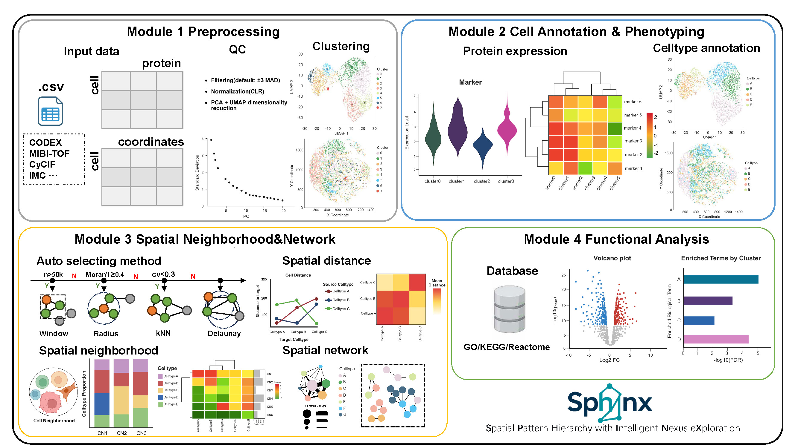

# Sphinx

[](https://github.com/mongi126/Sphinx/actions/workflows/R-CMD-check.yaml)
[](https://opensource.org/licenses/MIT)
[](https://github.com/mongi126/Sphinx/commits/main)
[](https://github.com/mongi126/Sphinx/releases)
[](https://www.r-project.org/)
[](https://mongi126.github.io/Sphinx/)

Sphinx is an R toolkit for **spatial proteomics**: preprocessing, annotation, spatial neighborhood graphs, and functional enrichment—with publication-ready plots.

<p align="center">
  
</p>

Documentation demos use **reg055_A** from Schurch *et al.* CODEX CRC (*Cell* 2020): ~3.9k cells with annotated cell-type labels.

**Example data download:** [SpatialOmics dataset 60](https://gene.ai.tencent.com/SpatialOmics/dataset?datasetID=60) → select **reg055_A**.

## Installation

```r
devtools::install_github("mongi126/Sphinx")
# or: install.packages("Sphinx_1.0.1.tar.gz", repos = NULL, type = "source")
```

## Quick start

```r
library(Sphinx)

df <- prepare_data(meta, celltype_col = "celltype")
edges <- build_spatial_network(df, method = "auto")
feat <- calculate_neighborhood_features(df, edges)
clus <- cluster_neighborhoods(feat, edges, method = "kmeans", k = 10)

visualize_spatial_distribution(df)
visualize_spatial_network(clus, edges, edge_mode = "top", top_n = 1500, point_alpha = 1)
```

## Documentation

- Website: https://mongi126.github.io/Sphinx/
- Vignettes: `vignette("workflow", package = "Sphinx")`
- Issues: https://github.com/mongi126/Sphinx/issues

## License

MIT © Mengyi Yan
