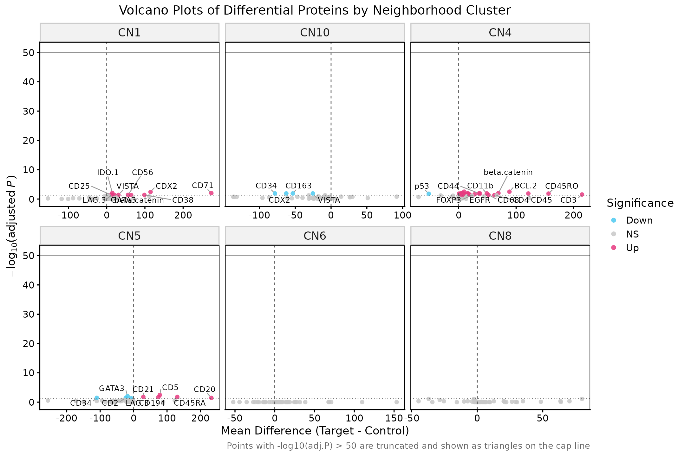
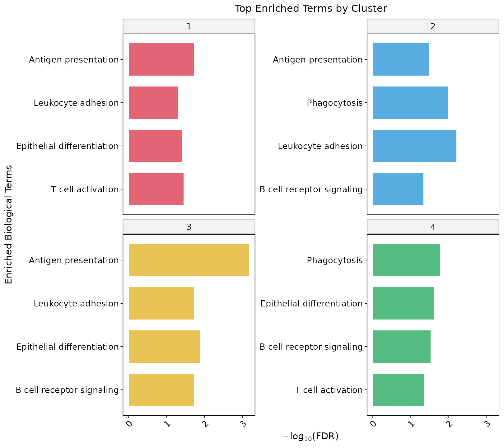
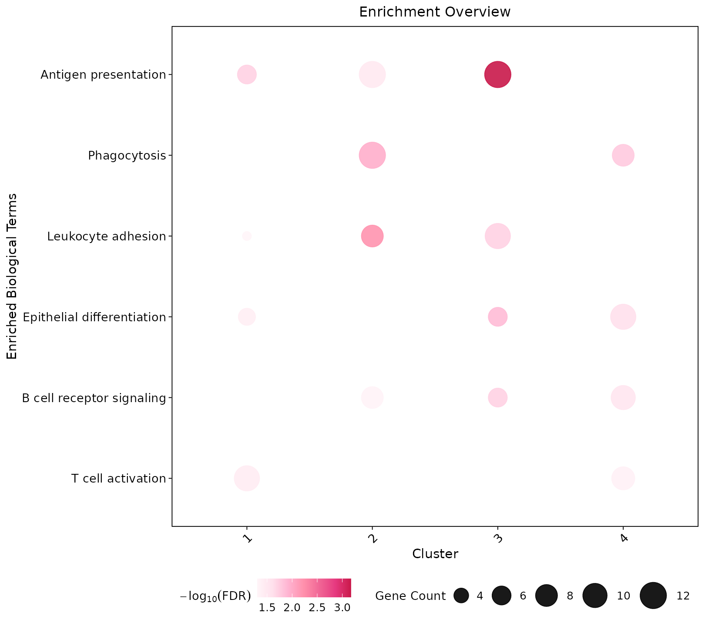

# Functional Analysis

## Overview

This module connects neighborhood structure to protein programs:
differential testing (spatial-block aware by default), volcano plots
with a capped y-axis, and enrichment summaries.

**Demo:** reg055\_A panel expression with neighborhood clusters from the
spatial-network tutorial.

## Prepare protein table

``` r
library(Sphinx)
library(dplyr)

protein_df <- prepare_protein_data(clus, expr_df)
```

## Differential expression

``` r
diff_res <- perform_differential_expression(
  protein_df,
  test_level = "spatial_block"
)
```

## Volcano plots

`-log10(adjusted P)` is capped at `y_cap` (default **50**). Points above
the cap are drawn as triangles on the truncation line.

``` r
plot_volcano_all_clusters(
  diff_res,
  diff_thresh = 0.15,
  p_thresh = 0.05,
  y_cap = 50,
  ncol = 3,
  save_plot = TRUE,
  output_dir = "functional_plots",
  filename = "VolcanoPlots_AllClusters"
)
```



## Enrichment

``` r
enrich <- perform_cluster_enrichment(
  diff_res,
  species = "human",
  pvalueCutoff = 0.05,
  mean_diff_cutoff = 0
)

plots <- plot_enrichment_results(
  enrich,
  top_n = 5,
  fdr_cutoff = 0.05,
  base_font_size = 12,
  save_plot = TRUE,
  output_dir = "enrichment_plots"
)
```





## Tips for targeted CODEX panels

  - Prefer the assayed protein list as EnrichR `background` (Sphinx
    default).
  - Use `test_level = "spatial_block"` for tissue DE.
  - Plotting helpers still work offline on any table with `Cluster`,
    `Term`, `FDR`, and `GenesN`.
