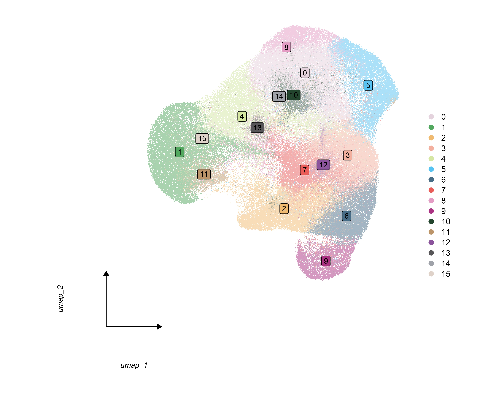

# Data Preprocessing

This tutorial demonstrates the complete data preprocessing workflow for
spatial proteomics data using Sphinx.

## Load Required Packages

``` r

library(Sphinx)
library(Seurat)
library(ggplot2)
library(patchwork)
```

## 1. Load Spatial Data

``` r

# Load spatial data from CSV file
obj <- load_spatial_data(filename = "TSU-33_FF_measurements_mod.csv")

# Check basic object information
print(obj)
```

## 2. Quality Control Filtering

``` r

# Filter low-quality cells using MAD-based thresholds
obj_filtered <- filter_data(
  obj,
  nCount_mad_threshold = 5,        # More stringent MAD threshold
  nFeature_quantile_threshold = 0.05  # Remove bottom 5% of cells by feature count
)

# Report filtering statistics
message("Initial cells: ", ncol(obj))
message("After filtering: ", ncol(obj_filtered))
message("Cells removed: ", ncol(obj) - ncol(obj_filtered))
```

## 3. Data Processing

``` r

# Process data with dimensionality reduction and clustering
obj_processed <- process_data(
  obj_filtered,
  dims = 1:10,        # PCA dimensions to use
  resolution = 0.5    # Clustering resolution
)

# Check processing results
print(obj_processed)
```

## 4. Determine Optimal Dimensions

``` r

# Generate elbow plot to determine optimal PCA dimensions
plot_elbow(obj_processed, "elbow_plot.png")
```


*Elbow plot showing explained variance by PCA components. The “elbow”
indicates optimal number of dimensions.*

## 5. Extract Spatial Coordinates

``` r

# Extract and verify spatial coordinates
obj_processed <- extract_spatial_coordinates(obj_processed)

# Check coordinate extraction
head(obj_processed@meta.data[, c("X", "Y")])
```

## 6. Visualize Results

``` r

# Generate comprehensive visualizations
plots <- visualize_results(obj_processed, save_dir = "./results/")
```

### Cluster UMAP Visualization



*UMAP visualization showing cell clusters in reduced dimensional space.*

## 7. Save Processed Data

``` r

# Save processed object for downstream analysis 
saveRDS(obj_processed, "tsu33_processed.rds")
```
