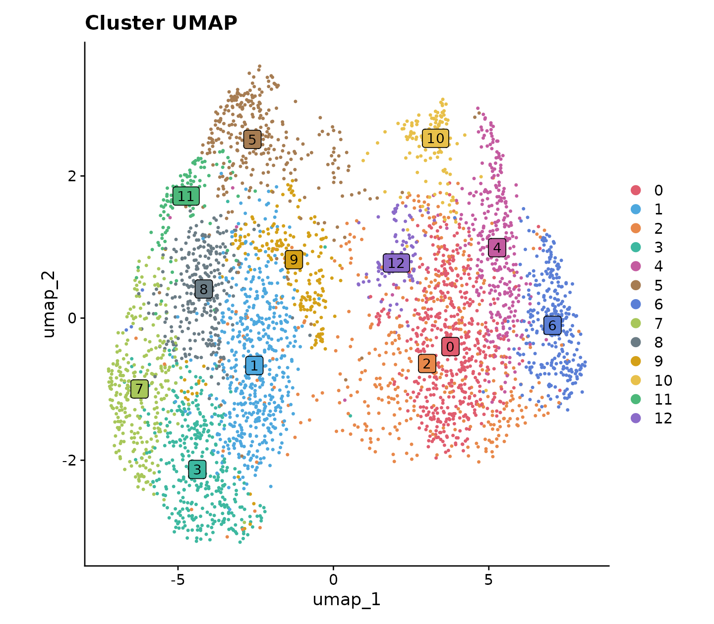
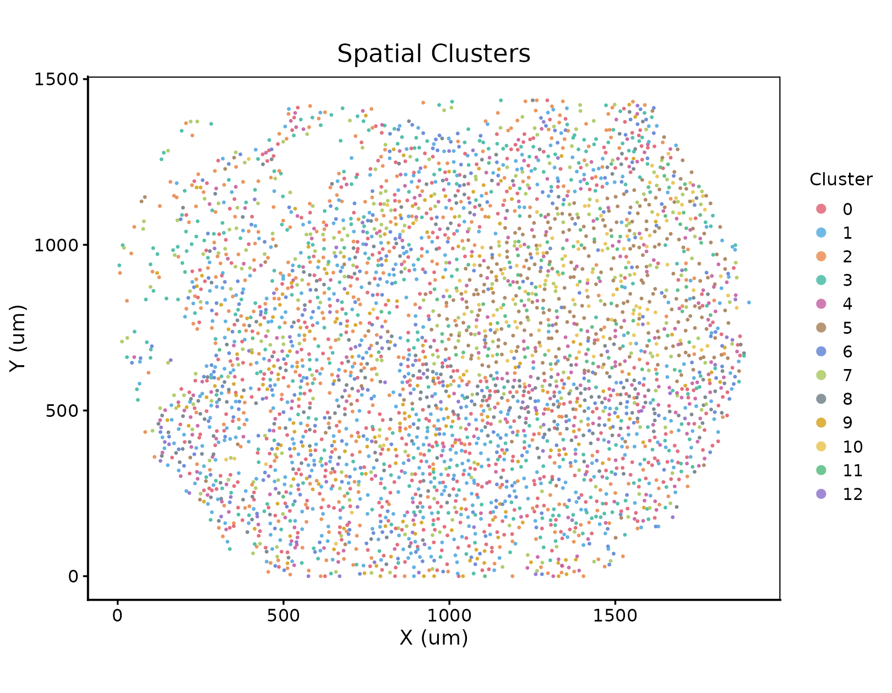

# Data Preprocessing

## Overview

This module prepares spatial proteomics inputs (CODEX / CyCIF / MIBI
tables or Seurat objects): QC filtering, normalization, dimensionality
reduction, and clustering.

Examples use **reg055\_A** (CODEX CRC, Schurch *et al.* 2020).

## Load packages

``` r
library(Sphinx)
library(Seurat)
library(dplyr)
library(ggplot2)
```

## Load spatial data

``` r
obj <- load_spatial_data(filename = "reg055_A_counts_with_coords.csv")
# Or construct a Seurat object from an expression matrix plus X / Y metadata.
```

## QC filtering

``` r
obj_filtered <- filter_data(obj, nFeature_quantile_threshold = 0.05)
```

## Normalize, PCA, cluster

``` r
obj_processed <- process_data(obj_filtered, dims = 1:15, resolution = 0.5)
```

## Elbow plot

``` r
plot_elbow(obj_processed, save_path = "elbow_plot.png")
```


## Extract spatial coordinates

``` r
obj_processed <- extract_spatial_coordinates(obj_processed)
```

## Quick cluster views

``` r
plots <- visualize_results(obj_processed, save_dir = "preprocess_plots/")
# plots$umap_plot, plots$spatial_plot
```





`visualize_results()` writes a cluster UMAP and a spatial map of cluster
IDs using the package color palette.

## Save

``` r
saveRDS(obj_processed, "reg055_A_processed.rds")
```

## Next step

`vignette("annotation", package = "Sphinx")`, or jump to spatial
networks if labels are ready: `vignette("spatial-network", package =
"Sphinx")`.
