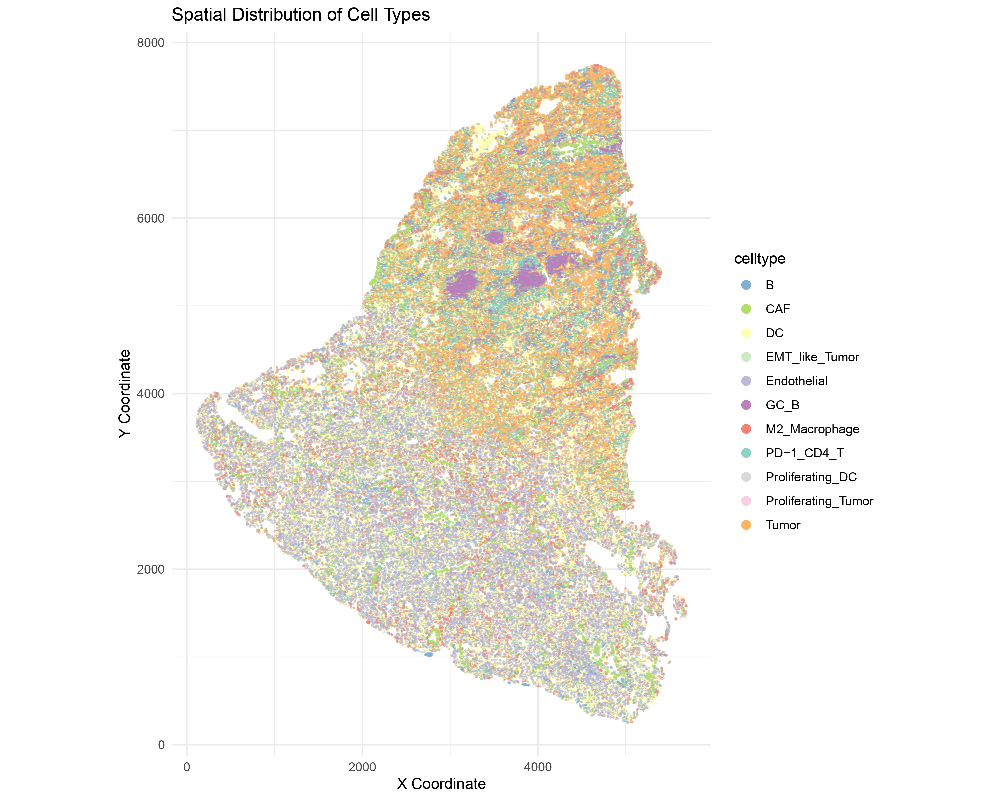
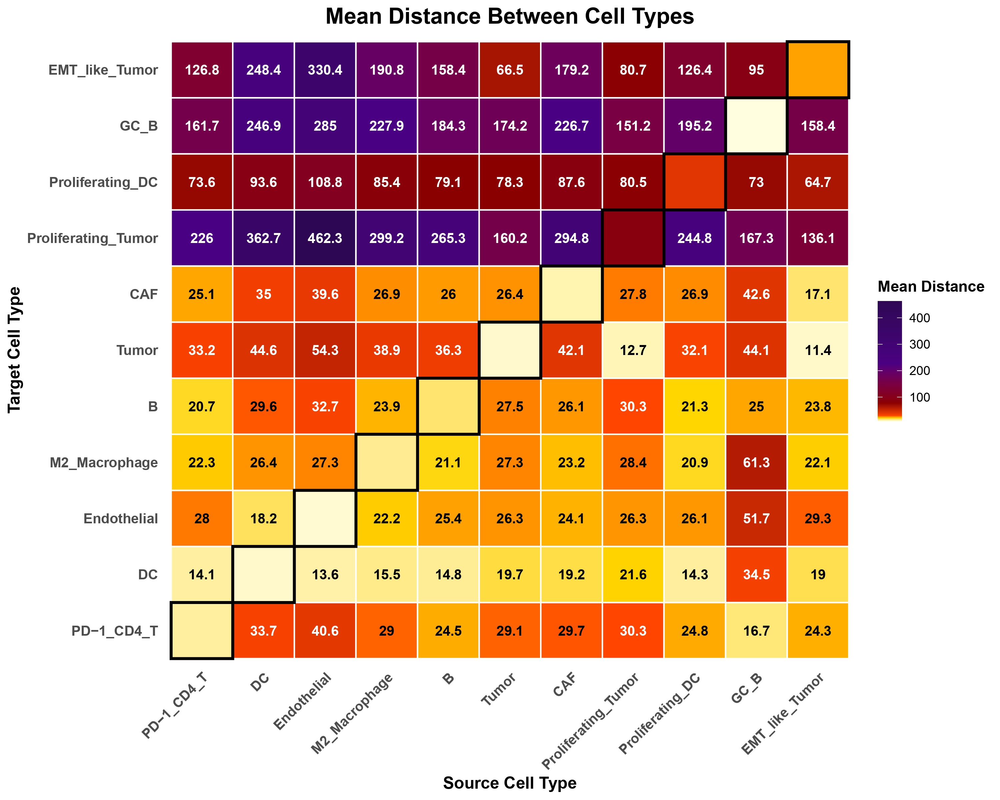
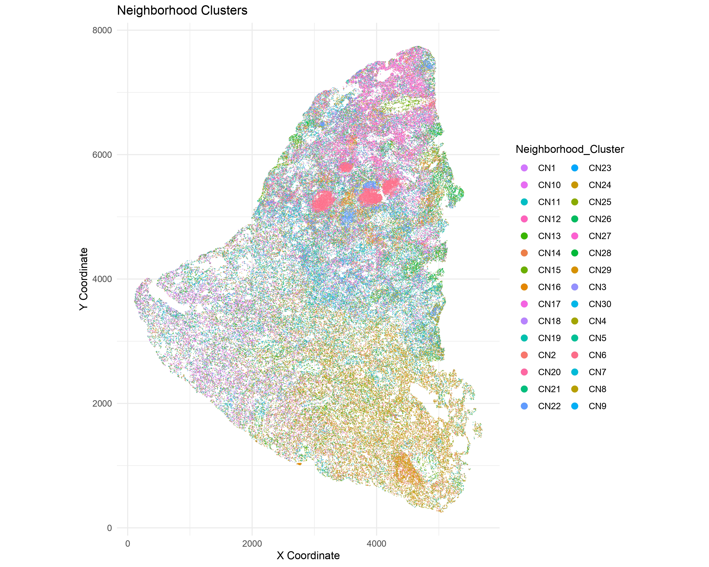
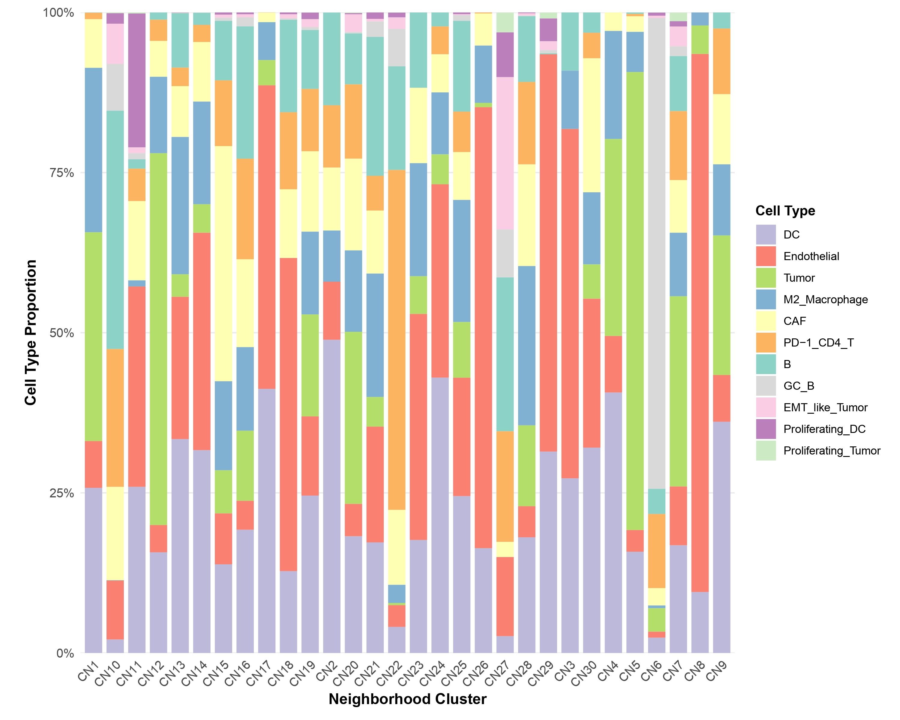
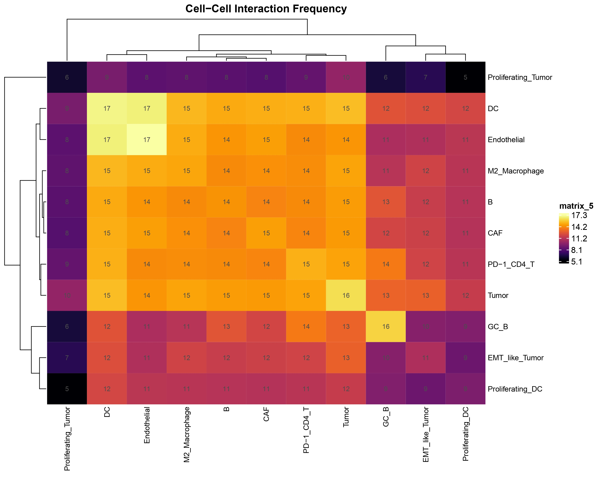
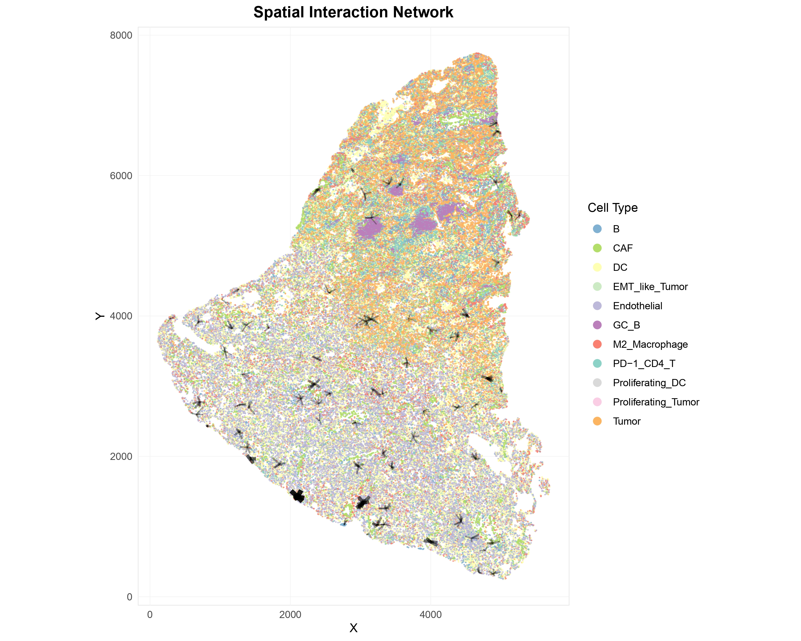
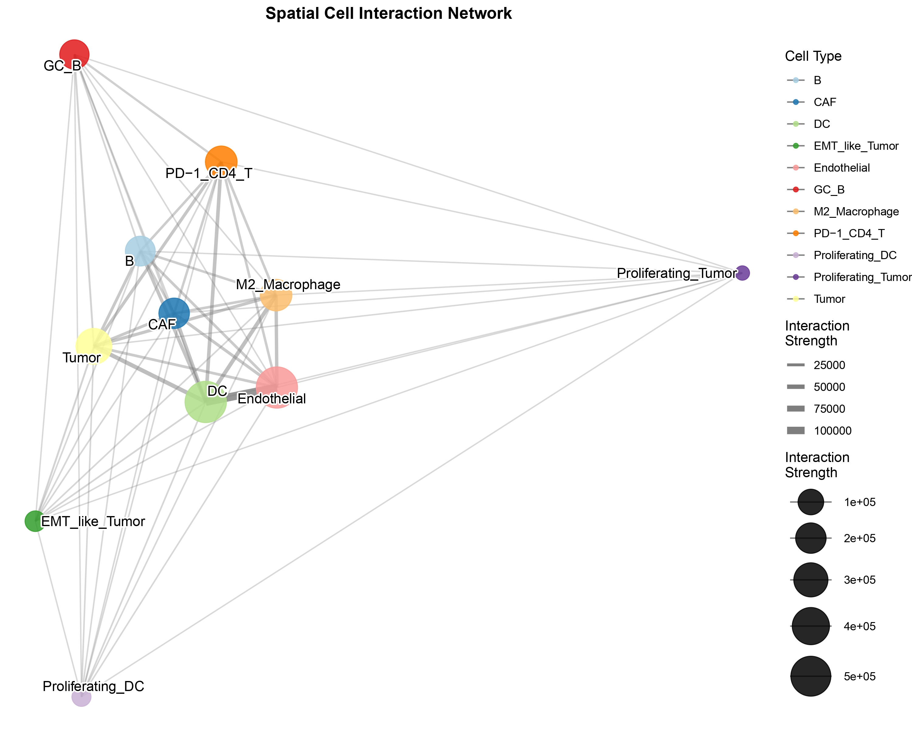
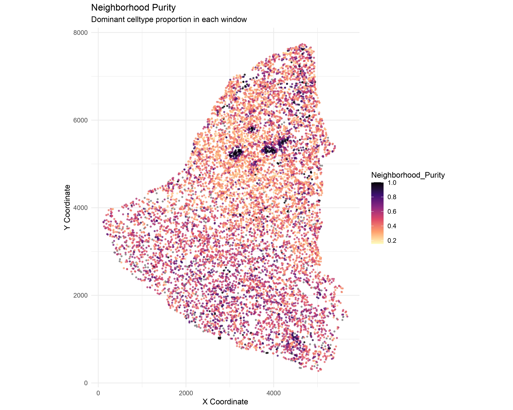

# Spatial Network Analysis

This tutorial demonstrates the complete workflow for spatial network
analysis using Sphinx package.

## Load Required Packages

``` r

library(Sphinx)
library(data.table)
library(ggplot2)
library(ComplexHeatmap)
```

## 1.Data Preparation

``` r

# Load spatial metadata
df <- fread("tsu35_metadata.csv")

# Prepare data for spatial analysis
df <- prepare_data(df,
                   cell_id_col = "V1",
                   celltype_col = "celltype")
```

### Spatial Distribution of Cell Types

``` r

visualize_spatial_distribution(
  df,
  x_col = "X",
  y_col = "Y",
  celltype_col = "celltype",
  point_size = 0.7,
  title = "Spatial Distribution of Cell Types"
)
```



*Visualize spatial cell type distribution*

## 2.Spatial Distance Analysis

``` r

# Calculate optimal radius for neighborhood definition
dist_info <- calculate_optimal_radius(df)
message("Recommended radius: ", round(dist_info$recommended_radius, 2))

# Calculate distances between cell types
dist_result <- calculate_celltype_distances(df, celltype_col = "celltype")
visualize_distance_heatmap(dist_result)
```



``` r

visualize_distance_parallel(dist_result)
```

## 3.Spatial Network Construction

``` r

# Build spatial network using automatic method selection
spatial_edges <- build_spatial_network(
  df,
  method = "auto",
  celltype_col = "celltype"
)
```

## 4.Neighborhood Feature Calculation

``` r

# Calculate neighborhood composition features
feature_df <- calculate_neighborhood_features(
  df, 
  spatial_edges,
  celltype_col = "celltype"
)
```

## 5.Neighborhood Clustering

``` r

# Cluster neighborhoods based on spatial features
clustered_df <- cluster_neighborhoods(
  feature_df = feature_df,
  spatial_edges = spatial_edges,
  method = "kmeans",
  k = 12
)

message("Identified ", length(unique(clustered_df$Neighborhood_Cluster)), " neighborhood clusters")
```

### Neighborhood Clusters

``` r

visualize_spatial_distribution(
  clustered_df,
  x_col = "X", 
  y_col = "Y",
  celltype_col = "Neighborhood_Cluster",
  point_size = 1.5,
  point_alpha = 0.6,
  title = "Neighborhood Clusters"
)
```



### Cluster Composition

``` r

# Calculate cluster composition
comp_df <- calculate_cluster_composition(
  clustered_df,
  cluster_col = "Neighborhood_Cluster", 
  celltype_col = "celltype"
)

# Plot composition bar plot
plot_composition_barplot(
  comp_df,
  cluster_col = "Neighborhood_Cluster",
  celltype_col = "celltype", 
  value_col = "proportion"
)
```



### Voronoi Diagram

``` r

visualize_voronoi(
  clustered_df,
  coloring = "neighborhood",
  celltype_col = "celltype",
  neighborhood_col = "Neighborhood_Cluster"
)
```


## 6.Spatial Interaction Analysis

``` r

# Analyze cell-cell spatial interactions
interaction_results <- analyze_spatial_interactions(
  clustered_df,
  spatial_edges,
  celltype_col = "celltype"
)
```

### Cell-Cell Interactions

``` r

visualize_interaction_heatmap(
  interaction_results$interaction_matrix, 
  transform = TRUE
)
```



### Spatial Network Visualization

``` r

visualize_spatial_network(
  clustered_df,
  spatial_edges,
  celltype_col = "celltype",
  x_col = "X",
  y_col = "Y", 
  edge_mode = "top",
  top_n = 5,
  point_size = 0.01,
  point_alpha = 0.7,
  edge_size_range = c(0.3, 2),
  edge_alpha_range = c(0.3, 0.9),
  edge_color = "black"
)
```



### Interaction Network Graph

``` r

visualize_interaction_network(
  interaction_results$network,
  node_size_range = c(5, 15),
  edge_size_range = c(0.5, 3),
  label_size = 4,
  show_labels = TRUE,
  max_nodes = 50
)
```



## 7.Neighborhood Purity Analysis

``` r

# Calculate neighborhood purity using radius method
neighborhood_purity <- calculate_neighborhood_purity(
  clustered_df,
  x_col = "X",
  y_col = "Y", 
  celltype_col = "celltype",
  method = "radius",
  radius = 16.8,
  min_cells = 5,
  verbose = TRUE
)
```

### Neighborhood Purity Graph

``` r

visualize_neighborhood_purity(
    neighborhood_purity,
    x_col = "X",
    y_col = "Y",
    celltype_col = "celltype",
    # max_points = 1000,
    point_size = 1.0,
    point_alpha = 0.8,
    title = "Neighborhood Purity"
  )
```


