# Spatial Network Analysis

## Overview

This module builds adaptive spatial graphs, derives neighborhood
features and clusters, and visualizes distances, composition, purity,
and cell-cell interactions.

**Demo:** reg055\_A (CODEX CRC, Schurch *et al.* 2020) with annotated
cell-type labels from the annotation tutorial.

## Load packages and prepare data

``` r
library(Sphinx)
library(data.table)
library(dplyr)
library(ggplot2)

# meta: Cell_ID, X, Y, celltype
df <- prepare_data(
  meta, cell_id_col = "Cell_ID", x_col = "X", y_col = "Y",
  celltype_col = "celltype"
)
```

## Spatial distribution

``` r
visualize_spatial_distribution(
  df, point_size = 0.45, point_alpha = 0.95,
  title = "Annotated cell types"
)
```

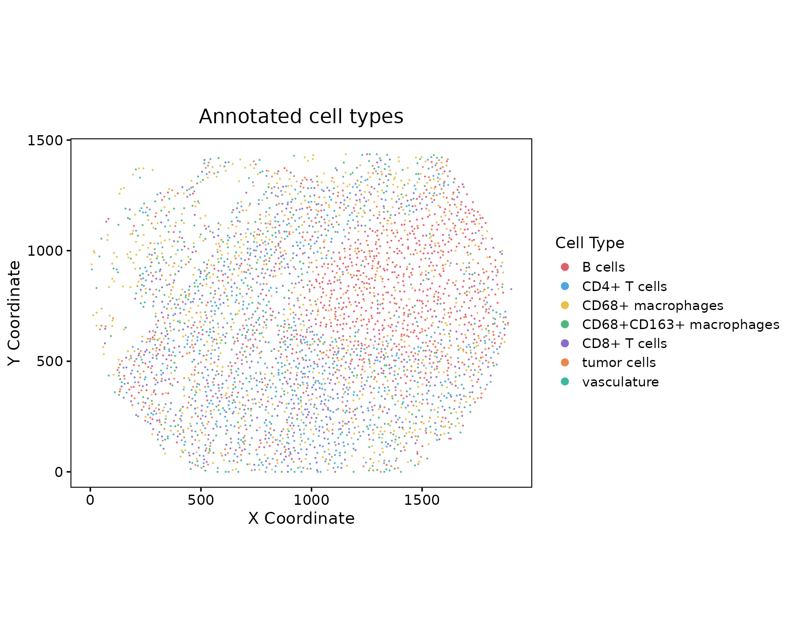

## Cell-type distances

``` r
dist_result <- calculate_celltype_distances(df, celltype_col = "celltype")
visualize_distance_heatmap(dist_result, show_values = TRUE)
visualize_distance_parallel(dist_result)
```

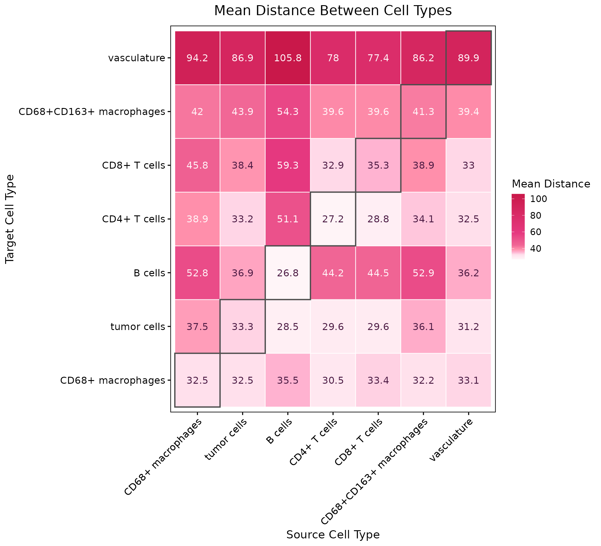

## Build spatial network

`build_spatial_network()` selects a graph method (`auto` / knn / radius
/ delaunay / window) and applies biological edge filtering (mutual
nearest neighbors and distance gating where configured).

``` r
edges <- build_spatial_network(df, method = "auto", celltype_col = "celltype")
feat <- calculate_neighborhood_features(df, edges, celltype_col = "celltype")
clus <- cluster_neighborhoods(feat, edges, method = "kmeans", k = 10)
```

## Neighborhood clusters & composition

``` r
visualize_spatial_distribution(
  clus, celltype_col = "Neighborhood_Cluster",
  point_size = 0.45, title = "Neighborhood clusters"
)

comp <- calculate_cluster_composition(clus)
plot_composition_barplot(comp)
plot_composition_heatmap(comp, cell_fontsize = 10)
```

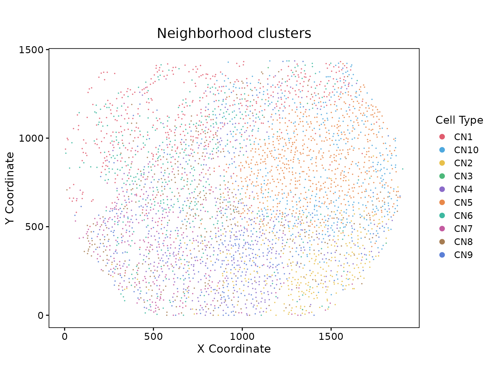

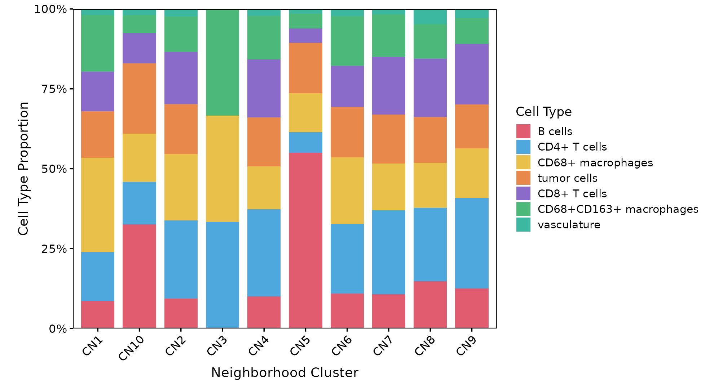

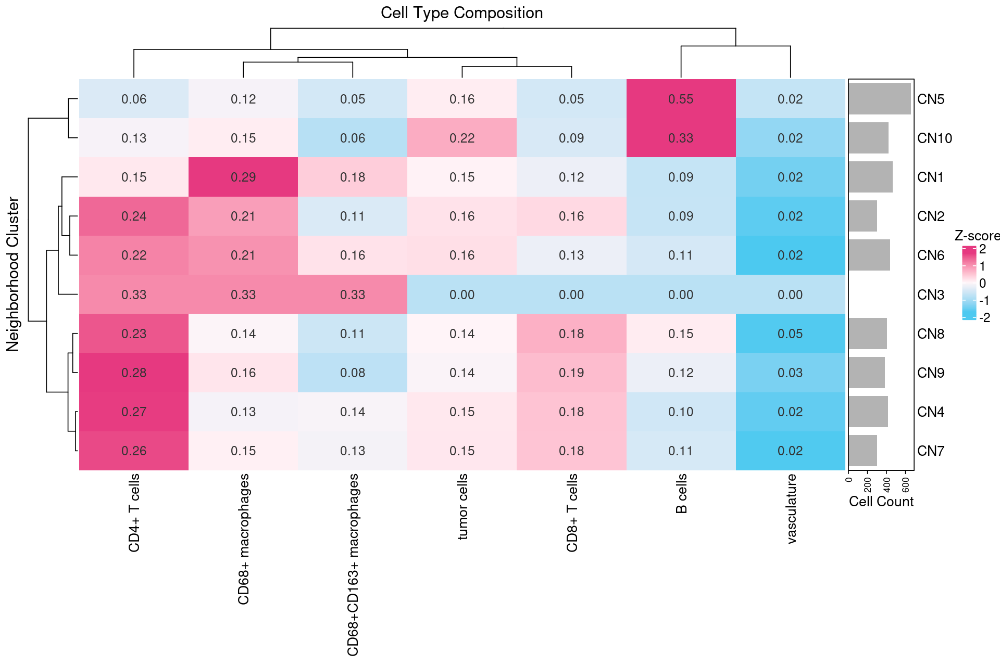

## Neighborhood purity

``` r
pur <- calculate_neighborhood_purity(clus, method = "knn", n_neighbors = 10)
visualize_neighborhood_purity(pur, point_size = 0.55)
```

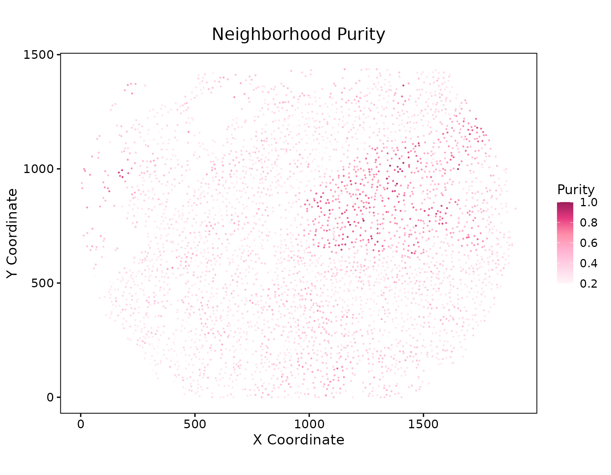

## Interactions

``` r
intx <- analyze_spatial_interactions(clus, edges, celltype_col = "celltype")

visualize_interaction_heatmap(
  intx$interaction_matrix, transform = TRUE,
  display_numbers = FALSE, cellwidth = 10, cellheight = 10
)

visualize_interaction_network(intx$network)
```

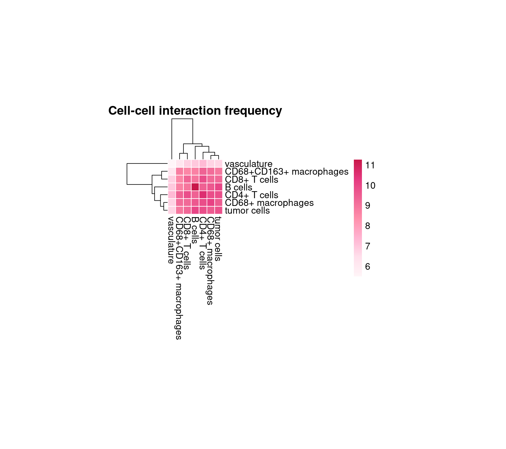

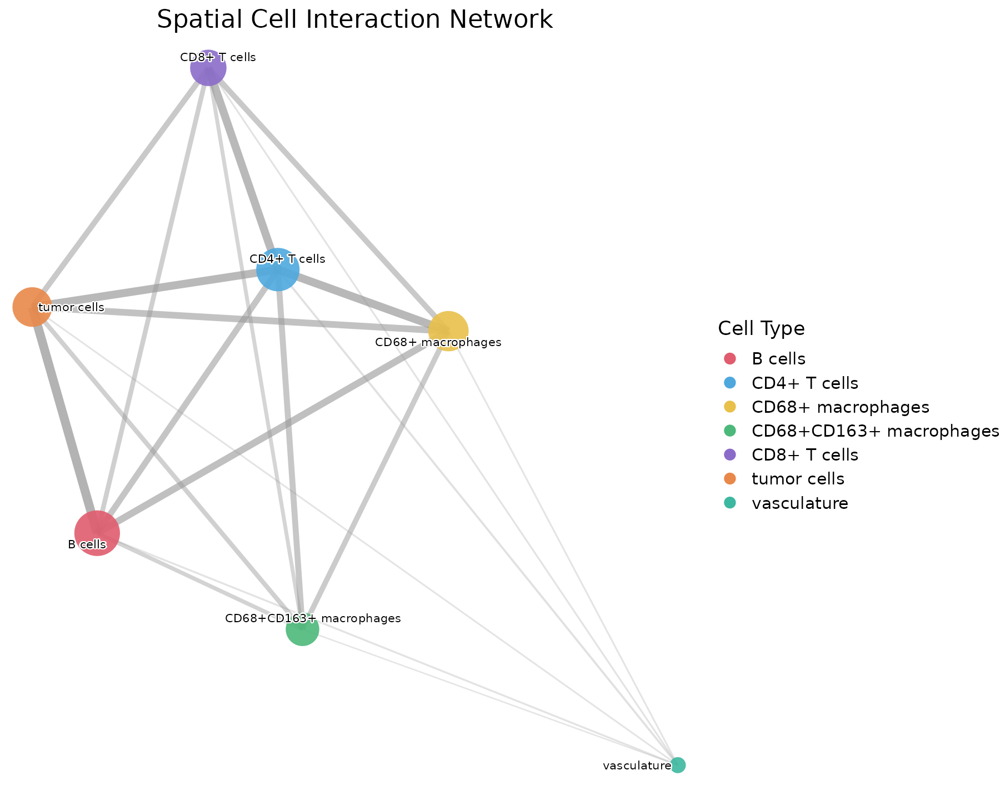

## Spatial network graph (real edges)

Points are opaque with a white halo so colors remain clear over edges.
For overview plots use `edge_mode = "top"`; for local zoom, shrink
`zoom_radius` and downsample edges with `edge_mode = "random"` so
structure stays readable.

``` r
visualize_spatial_network(
  clus, edges, edge_mode = "top", top_n = 1200,
  point_size = 0.5, point_alpha = 1
)

cx <- mean(range(clus$X)); cy <- mean(range(clus$Y))
zr <- max(diff(range(clus$X)), diff(range(clus$Y))) * 0.07
visualize_spatial_network(
  clus, edges,
  edge_mode = "random", max_edges = 180,
  zoom_center = c(cx, cy), zoom_radius = zr,
  point_size = 2.2, point_alpha = 1,
  title = "Spatial network (local zoom)"
)
```

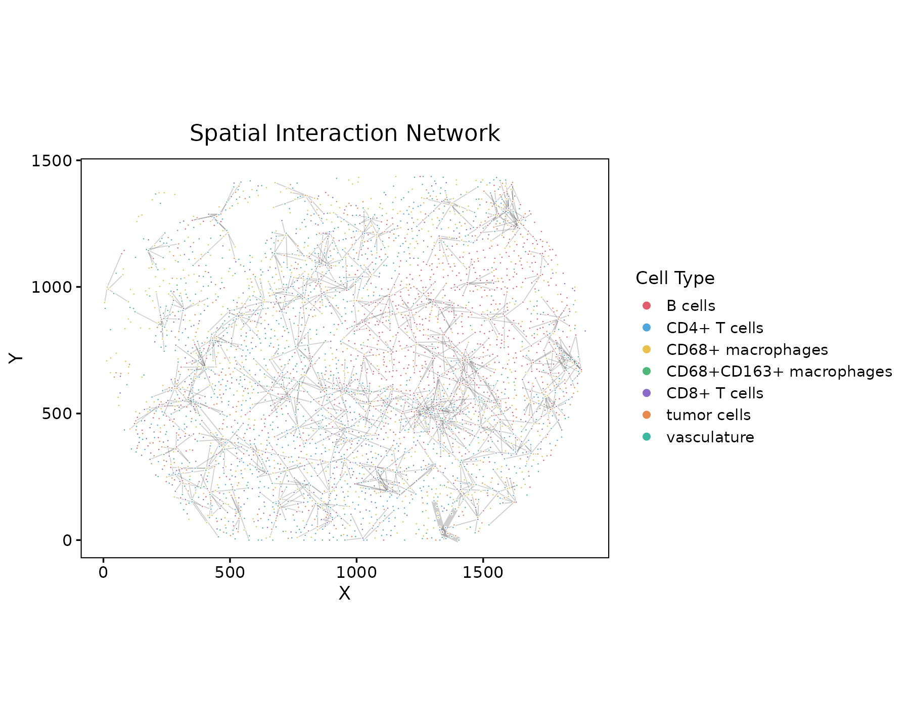

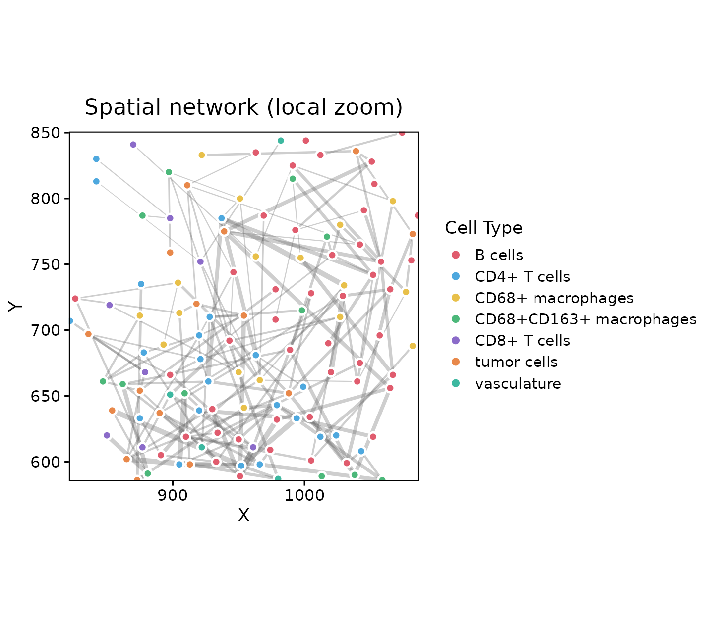

## Voronoi view

``` r
visualize_voronoi(clus, coloring = "neighborhood")
```

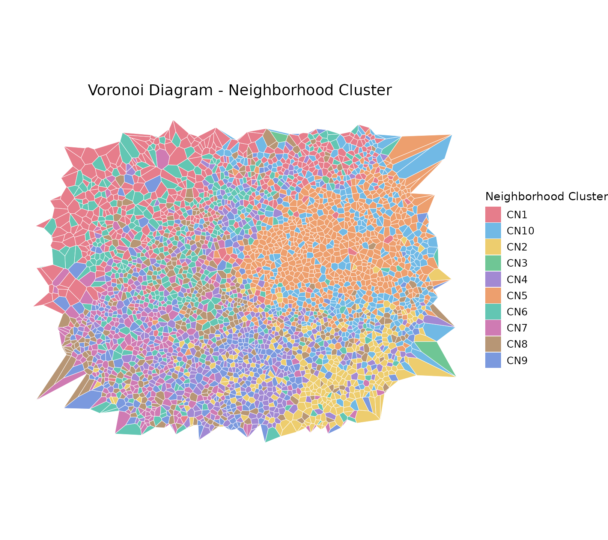

## Next step

`vignette("functional", package = "Sphinx")`
