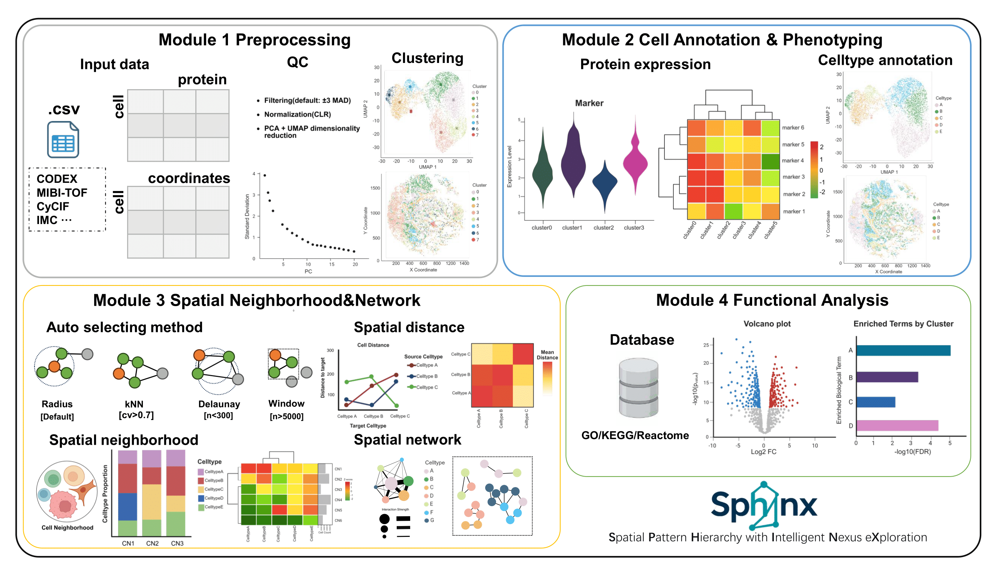

# Sphinx

A comprehensive toolkit for spatial proteomics data analysis, including
preprocessing, clustering, annotation, spatial network analysis, and
functional enrichment. Supports various spatial platforms and provides
publication-ready visualizations.

## Installation

``` r
# Install development version from GitHub
devtools::install_github("mongi126/Sphinx")
library(Sphinx)
```

    # Check if package loaded correctly
    packageVersion("Sphinx")

## Workflow



**Module 1. Data Preprocessing**

- Data import and format standardization
- Filtering of low-quality cells and proteins
- Normalization and noise reduction
- Extraction of spatial coordinates

**Module 2. Cell Annotation**

- Discovery of cell-type-specific marker proteins
- UMAP and spatial visualization
- Automatic or semi-automatic cell type annotation

**Module 3. Spatial Neighborhood and Network**

- Neighborhood network construction (kNN, Delaunay, radius, window)
- Calculation of neighborhood features
- Clustering and spatial visualization
- Cell–cell interaction analysis

**Module 4. Functional Analysis**

- Differential protein analysis
- Cluster-specific pathway enrichment (GO, KEGG, Reactome)
- Visualization of enrichment results
