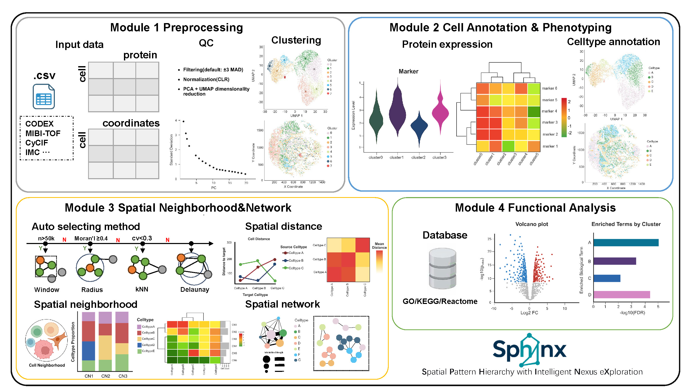

---
title: "Workflow"
output: rmarkdown::html_vignette
vignette: >
  %\VignetteIndexEntry{Workflow}
  %\VignetteEngine{knitr::rmarkdown}
  %\VignetteEncoding{UTF-8}
---

```{r setup, include=FALSE}
knitr::opts_chunk$set(echo = TRUE, comment = "#>")
```

## Overview

**Sphinx** is an R package for **spatial proteomics analysis**. It provides an end-to-end workflow built on [Seurat](https://satijalab.org/seurat/) for:

-   Data preprocessing and quality control
-   Cell-type annotation and marker discovery
-   Spatial neighborhood modeling and interaction analysis
-   Functional enrichment and publication-ready visualization

Sphinx supports common spatial proteomics platforms (e.g., CODEX, CyCIF, IMC) and accepts tabular count matrices with spatial coordinates.

## Installation

Install the development version from GitHub (see `vignette("installation", package = "Sphinx")` for details):

```{r install, eval=FALSE}
devtools::install_github("mongi126/Sphinx")
library(Sphinx)
packageVersion("Sphinx")
```

## Quick start

The typical analysis pipeline follows four sequential modules. Each step produces a Seurat object that feeds into the next:

```{r quick-start, eval=FALSE}
library(Sphinx)
library(Seurat)

# 1. Preprocessing
obj <- load_spatial_data("your_data.csv")
obj <- filter_data(obj)
obj <- process_data(obj)

# 2. Cell annotation
markers <- find_top_markers(obj)
obj     <- annotate_celltypes(obj, markers)

# 3. Spatial network
obj <- prepare_data(obj)
net <- build_spatial_network(obj, method = "knn")
obj <- calculate_neighborhood_features(obj, net)

# 4. Functional analysis
de_results <- perform_differential_expression(obj)
enrichment <- perform_cluster_enrichment(de_results)
```

For platform-specific parameters and visualization options, see the module tutorials linked below.

## Analysis workflow

The overall workflow is summarized below:

```{r workflow-figure, echo=FALSE, out.width="100%"}

```

### Module 1. Data preprocessing

-   Import spatial data and standardize format (`load_spatial_data()`)
-   Filter low-quality cells and proteins (`filter_data()`)
-   Normalize, scale, and cluster (`process_data()`)
-   Extract spatial coordinates (`extract_spatial_coordinates()`)

**Tutorial:** `vignette("preprocessing", package = "Sphinx")`

### Module 2. Cell annotation

-   Identify cluster-specific marker proteins (`find_top_markers()`)
-   Visualize markers on UMAP and spatial maps
-   Annotate cell types automatically or manually (`annotate_celltypes()`)

**Tutorial:** `vignette("annotation", package = "Sphinx")`

### Module 3. Spatial neighborhood and network

-   Build spatial graphs (kNN, Delaunay, radius, or window methods)
-   Compute neighborhood composition and spatial metrics
-   Analyze cell鈥揷ell interactions and spatial organization

**Tutorial:** `vignette("spatial-network", package = "Sphinx")`

### Module 4. Functional analysis

-   Perform differential protein expression across clusters
-   Run pathway enrichment (GO, KEGG, Reactome)
-   Visualize enrichment and volcano plots

**Tutorial:** `vignette("functional", package = "Sphinx")`

## Getting help

```{r help, eval=FALSE}
# Package documentation
help(package = "Sphinx")

# Function reference
?load_spatial_data
?build_spatial_network
```

Report bugs and request features on [GitHub Issues](https://github.com/mongi126/Sphinx/issues).
